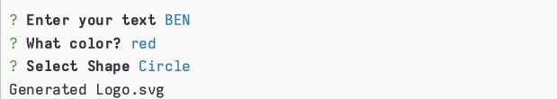

# SVGMe

## Description

SVGMe was designed to generate SVG's on the fly! Using this tool within the command line you can create a SVG by stipulating the text inside (limit of 3 characters), the color by name or hexidecimal number, and the shape (circle, triangle, or square) and Bam! You're Done! Files will be exported as logo.svg in the examples directory.

Demo: https://youtu.be/wBcrxHAvkXU

## Table of Contents

- [Installation](#installation)
- [Usage](#usage)
- [Credits](#credits)
- [License](#license)

## Installation
The installation for this requires node package manager, simply run npm install to get the depedencies.

How do I install Dependencies?
npm i

## Usage

Use this app whenever you need a basic SVG shape with simple text and color!

## Credits

## License

This project is licensed under the MIT License.

Find more about this license here: https://opensource.org/licenses/MIT.

## Tests

How do I run tests?
npm test

## Questions

Please direct your questions towards Ben at:
Github: ZacZacariah
Email: ben-zac@outlook.com
